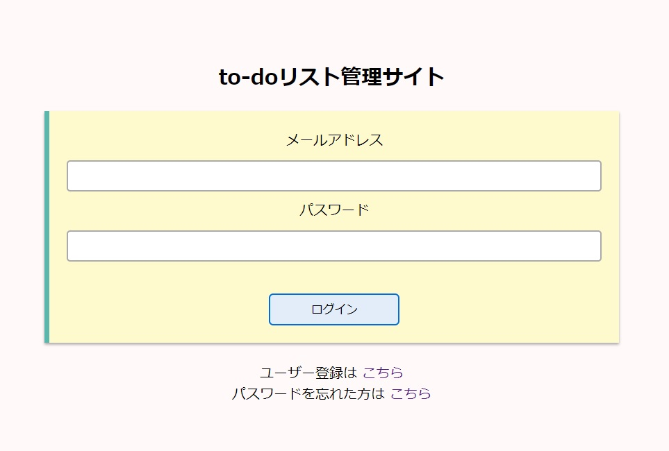
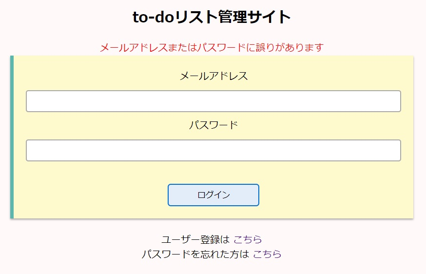
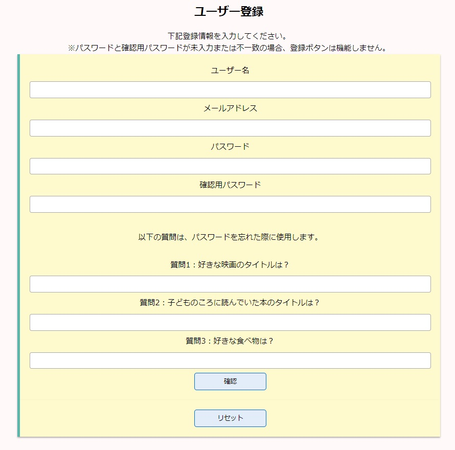
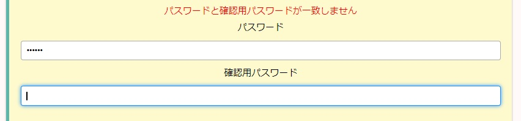
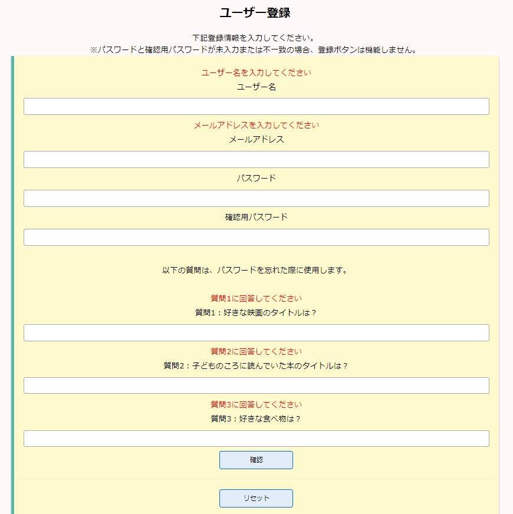
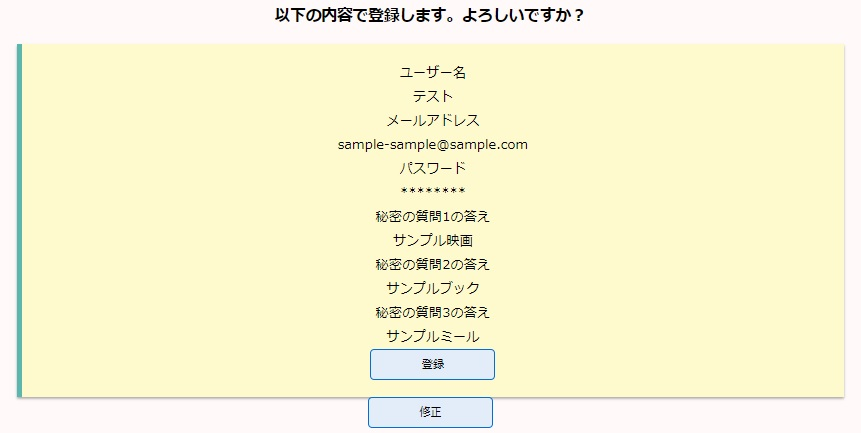
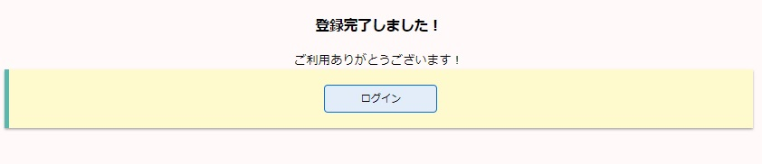
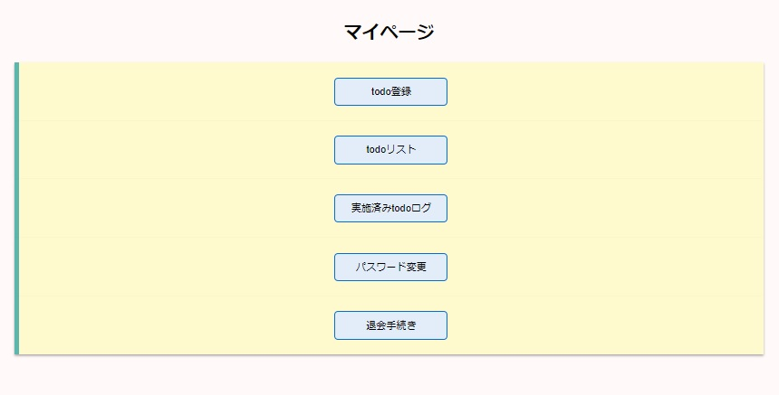
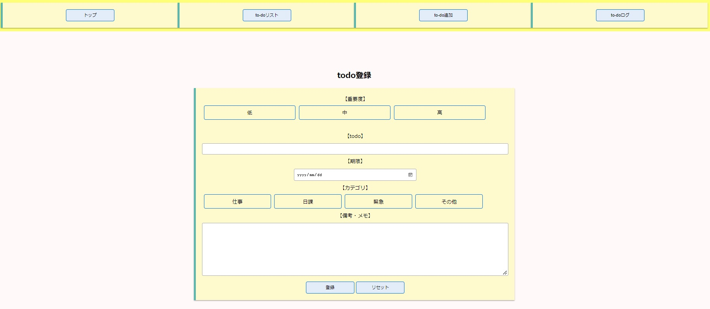
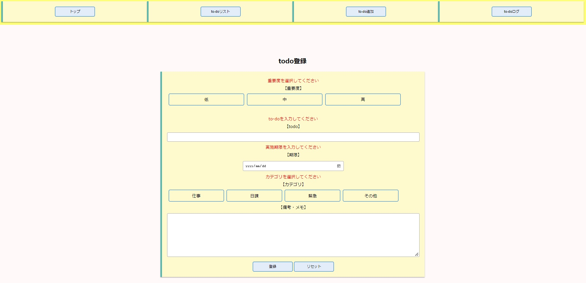

# todoList
やることリスト管理サイト
to-doの登録・管理を行うサイトです。

## 目次
- 使用ツール
- セットアップ
- 実装機能
## 使用ツール
フロント
- HTML
- CSS
- jQuery(3.6.0)

サーバー
- Java(openjdk 18.0.1.1)
- Springboot(2.7.0)
- Thymeleaf
- JavaScript

データベース
- PostgreSQL

## セットアップ
### Javaインストール
使用したのはopenjdk(18.0.1.1)です。  
インストールは[こちら](https://jdk.java.net/18/)から。

### Spring Tool Suiteインストール
使用したのはSpring Tools 4 for Eclipseです。  
最新バージョンは4.15.1です。  
インストールは[こちら](https://spring.io/tools)から。

### データベース
使用したのはPostgeSQLです。  
「todo」という名前のデータベースを作成し、[こちら]()のSQLを実行してください。  
## 実装機能

  
サイトマップ

  作成中

  
ユーザー登録・入力値チェック・ログイン機能
  
  
1.ログイン画面  
  
上記ログインページが表示されます。  
新規登録をする場合、パスワードを忘れた場合はログインフォーム下部のリンクをクリックします。  
メールアドレス、パスワードに誤りがある場合、もしくは空欄のままログインボタンを選択すると、  
下記のようにエラーメッセージが表示されます。  
  
メールアドレス、パスワードを入力し、データベースに情報が一致するものがあればログイン処理が行われます。  
その際にトークン（16桁の半角英数字の文字列）が発行され、以降はこれを利用してログイン認証を行う。  

2.ユーザー登録画面  
  
ログインページ内リンクを選択すると、上記の登録フォームが表示されます。  
パスワードと確認用パスワードの入力が一致しない場合、確認ボタンが活性化しないため登録確認が行えません。（JavaScript使用）  
  
パスワードと確認用パスワードを入力し、確認ボタンを押しても、入力されていない項目がある場合は  エラーメッセージが表示され、確認画面には進めません。  
  
 同一メールアドレスの使用を避けるため、登録済みメールアドレスで登録を行おうとした場合は  
エラーメッセージが表示され、確認画面には進めません。  
※パスワード以外の入力済み項目はフォームに残ったままになります。
  
不備なく入力が完了すると、下記のような確認画面に進みます。  
  
変更がなければ「登録」、修正項目があれば「修正」 ボタンを押します。  
修正ボタンを押すと、一つ前のページに戻ります。  
この時も、パスワード以外の入力済み項目は残った状態で表示されます。
  
登録ボタンを押すと、上記のページが表示されます。  
ログインボタンを押すと、ログインページに戻ります。  
	

  
マイページ

    
ログインすると、上記のページが表示されます。  
マイページトップを含め、ログインしていないと表示されないページはトークンの有無・有効性で  
判定を行うため、ブラウザの「戻る」などを使用すると再度ログインが必要になってしまいます。  

  
to-do登録

  
  
マイページ、もしくはヘッダーの「to-do登録」を押すと、上記のページが表示されます。  
重要度、to-doの内容、期限日、カテゴリが必須項目となっており、備考・メモは任意入力です。  
  
必須項目を入力しないまま登録ボタンを押すと、エラーメッセージが表示されます。  
必要事項を入力し、登録ボタンを押すとto-doが登録され、to-doリスト画面に移動します。

